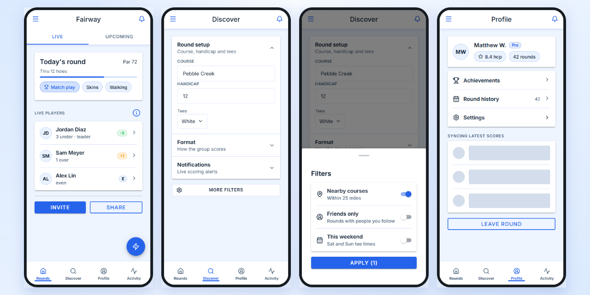

# g3-ui

[](https://github.com/g3techhq/g3-ui/actions/workflows/ci.yml)
[](https://github.com/g3techhq/g3-ui/actions/workflows/publish-playground-image.yml)
[](https://crates.io/crates/g3-ui)
[](https://docs.rs/g3-ui)
[](#license)

Mobile-first [Dioxus](https://dioxuslabs.com/) components inspired by [Ionic](https://ionicframework.com/).

<p align="center">
  
</p>

`g3-ui` is a component library for responsive apps that compile to web (WASM), desktop (Wry), and
native mobile through Dioxus. It covers bottom tabs that become a desktop rail, sheets, dialogs,
forms, and swipeable lists. Every component has iOS and Material Design (MD) styling,
CSS-variable theming, and WAI-ARIA semantics. The Rust crate name is `g3_ui`.

## Install

```toml
[dependencies]
dioxus = { version = "0.7.9", features = ["router"] }
g3-ui = "0.4"
```

Enable the optional route-transition integration when your app also uses `g3-route-transitions`:

```toml
[dependencies]
g3-ui = { version = "0.4", features = ["transitions"] }
g3-route-transitions = "0.4"
```

The minimum supported Rust version is 1.88.

## Quick Start

`AppWrapper` loads the stylesheet, resolves the platform mode, applies the theme, and hosts the
toasts, alerts, and action sheets opened from code. Everything else nests inside it.

```
use dioxus::prelude::*;
use g3_ui::prelude::*;

#[component]
fn App() -> Element {
    rsx! {
        AppWrapper { theme: Theme::system(),
            Header { title: "Games" }
            Content {
                Card { title: "Pending game",
                    "Invite players and choose a format."
                }
                Button { onclick: |_| {}, "Create game" }
            }
        }
    }
}
```

`g3_ui::prelude` exports the components and theme items only. Import `dioxus::prelude` yourself.
Component names are unprefixed. If one collides with a local name, import it under an alias
(`use g3_ui::Button as UiButton;`) or write the path (`g3_ui::Button { .. }`).

## Components

| Category | Components |
| --- | --- |
| App shell | `AppWrapper`, `Header`, `BackButton`, `Content`, `TabLayout`, `ThemeProvider` |
| Navigation | `AdaptiveNav`, `NavBar`, `NavRail`, `NavItem`, `NavigationDrawer`, `Tabs`, `TabList`, `Tab`, `TabPanel`, `SegmentGroup`, `SegmentButton` |
| Actions | `Button`, `Fab`, `FabButton`, `FabList`, `FabMenu`, `InfoButton`, `Popover`, `Menu`, `MenuItem` |
| Forms | `Input`, `TextArea`, `Select`, `Checkbox`, `Toggle`, `RadioGroup`, `Radio`, `Range`, `Stepper`, `Searchbar`, `DatePicker`, `TimePicker`, `Calendar` |
| Content | `Card`, `List`, `ListHeader`, `Item`, `SwipeItem`, `SwipeAction`, `Text`, `Img`, `Tooltip`, `Avatar`, `Badge`, `Chip`, `Divider` |
| Layout | `Stack`, `Grid` |
| Disclosure | `AccordionGroup`, `AccordionItem` |
| Overlays | `BottomSheet`, `SideSheet`, `Modal`, `Alert`, `ConfirmModal`, `ActionSheet`, `Toast` |
| Feedback | `Progress`, `Skeleton`, `Spinner`, `Refresher`, `InfiniteScroll` |

[docs.rs/g3-ui](https://docs.rs/g3-ui) has the full prop reference. The [playground](#playground)
shows every component live.

## Component State

A component with a value takes an optional `Signal<T>` and reads and writes it directly. Leave
the signal out and the component keeps its own state. An optional `onchange` or `on_*` callback
reports changes when you need a side effect as well:

```
# use dioxus::prelude::*;
# use g3_ui::prelude::*;
# fn demo() -> Element {
# #[derive(Clone, Copy, PartialEq)] enum Format { Stroke, Match }
# fn save(_name: String) {}
let checked = use_signal(|| false);
let name = use_signal(String::new);
let format = use_signal(|| None::<Format>);

rsx! {
    Toggle { checked, label: "Notifications" }
    Input { label: "Name", value: name, onchange: move |name| save(name) }
    RadioGroup { value: format, label: "Format",
        Radio { value: Format::Stroke, label: "Stroke play" }
        Radio { value: Format::Match, label: "Match play" }
    }
}
# }
```

`Select`, `RadioGroup`, `SegmentGroup`, `Tabs`, and `AccordionGroup` are generic over the value
type, so options can be your own enums instead of strings or indexes.

## Dates and Times

`DatePicker` and `TimePicker` are form fields that open a picker. They are the way in:
`Input` has no date or time kind, because the browser's own picker ignores the mode and
the theme. Their values are `CalendarDate` and `TimeOfDay`, which parse from and print as
ISO 8601 (`2026-09-19`, `14:05`), so nothing has to agree on a string format:

```
# use dioxus::prelude::*;
# use g3_ui::prelude::*;
# fn demo() -> Element {
let tee_day = use_signal(|| None::<CalendarDate>);
let tee_time = use_signal(|| None::<TimeOfDay>);

rsx! {
    DatePicker { label: "Tee day", value: tee_day, min: CalendarDate::today() }
    TimePicker { label: "Tee time", value: tee_time, minute_step: 10 }
}
# }
```

`style` decides how one opens. By default it follows the mode:

| `PickerStyle` | Date | Time |
|---|---|---|
| `Auto` | wheels on iOS, dialog on MD | wheels on iOS, dialog on MD |
| `Wheels` | month, day, and year columns in a bottom sheet | hour, minute, and AM/PM columns |
| `Dialog` | a calendar with Cancel and OK | a clock face, with a typing mode |
| `Popover` | a calendar anchored to the field | wheels anchored to the field |

A `Popover` picker becomes a bottom sheet on a phone. `Calendar` is also available on its
own, for a month grid inside a page.

Both are usable without a pointer. The calendar's arrow keys move a day at a time, Home and
End reach the ends of the week, and Page Up and Page Down change month or year. A wheel column
is a spin button, and the clock face is a radio group; Material's dialog can also be typed into.

## Pull to Refresh

Give `Content` an `on_refresh` handler and it refreshes when pulled down from the top. Keep
`refreshing` true while the work runs:

```
# use dioxus::prelude::*;
# use g3_ui::prelude::*;
# fn demo() -> Element {
# #[component] fn RoundList() -> Element { rsx! {} }
# async fn reload() {}
let mut refreshing = use_signal(|| false);

rsx! {
    Content {
        refreshing: refreshing(),
        on_refresh: move |_| async move {
            refreshing.set(true);
            reload().await;
            refreshing.set(false);
        },
        RoundList {}
    }
}
# }
```

## Overlays From Code

Toasts, alerts, and action sheets can be opened from an event handler without declaring them in
markup. `AppWrapper` renders them one at a time. Alerts and action sheets return a future with
the user's answer:

```
# use dioxus::prelude::*;
# use g3_ui::prelude::*;
# fn demo() {
# fn remove_round() {}
let toast = use_toast();
let alerts = use_alert();

let delete = move |_: MouseEvent| async move {
    if alerts.confirm("Delete round?", "This cannot be undone.").await {
        remove_round();
        toast.success("Round deleted");
    }
};
# }
```

`use_action_sheet()` works the same way and resolves to the chosen button's index. Each overlay is
also a component (`Toast`, `Alert`, `ActionSheet`) that takes an `open` signal, for cases where the
markup should own it.

## Modes and Themes

Components have Ionic-style `Ios` and `Md` modes. A component takes the first mode it finds: its
own `mode` prop, the nearest `AppWrapper` or `ThemeProvider`, then the global default set by
`set_mode` or `init_auto_mode`. Changing the provider's `mode` prop updates the subtree.

```no_run
# use dioxus::prelude::*;
# #[component] fn App() -> Element { rsx! {} }
fn main() {
    g3_ui::init_auto_mode(); // iOS look on Apple platforms, MD elsewhere
    dioxus::launch(App);
}
```

Colours are CSS custom properties (`--g3-color-*`) generated from a `Theme`. The presets are
`Theme::default_light()`, `Theme::default_dark()`, and `Theme::system()`, which follows the
operating system through CSS `light-dark()`. Every field is public:

```
# use dioxus::prelude::*;
# use g3_ui::prelude::*;
# fn demo() {
# let light_brand = Theme::default_light();
# let dark_brand = Theme::default_dark();
let brand = Theme::system().with_accent("#1f7a4d");

let custom = Theme {
    bg: "#0b1020".into(),
    card: "#151b2e".into(),
    ..Theme::default_dark()
};

let paired = Theme::adaptive(light_brand, dark_brand);
# }
```

The theme is written as inline custom properties on the wrapper, so passing a different `Theme`
re-themes the tree in place. `use_theme()` returns the theme in effect for code that needs the
values.

Built-in component text such as "Close" and "Cancel" comes from `Strings`. Pass translated
strings to `AppWrapper { strings, .. }`.

## Responsive App Shell

`AppWrapper` measures its own width with a CSS container query rather than the browser viewport,
so an app embedded in a narrow frame keeps its phone layout. At `48rem` and wider:

- `AdaptiveNav` inside a `TabLayout` moves from the bottom edge to a rail beside the page.
  `NavBar` and `NavRail` are the fixed forms, for apps that decide the layout themselves.
- Bottom sheets become floating panels, `Select` and `Popover` open as anchored menus instead of
  sheets, and modals widen.
- Toasts become a centred snackbar.

At `64rem` the `Header` toolbar moves inline with the title.

`Grid` takes `wide_columns` and `wide_gap` for the same breakpoint, and
`Content { width: ContentWidth::Readable }` keeps text at a comfortable width on a wide shell
while its scrollbar stays at the page edge.

```
# use dioxus::prelude::*;
# use g3_ui::prelude::*;
# fn demo() -> Element {
# #[derive(Routable, Clone, Debug, PartialEq)]
# enum Route {
#     #[route("/")]
#     Rounds {},
#     #[route("/profile")]
#     Profile {},
# }
# #[component] fn Rounds() -> Element { rsx! {} }
# #[component] fn Profile() -> Element { rsx! {} }
# #[component] fn Flag() -> Element { rsx! {} }
# #[component] fn User() -> Element { rsx! {} }
rsx! {
    TabLayout {
        Header { title: "Rounds" }
        Content { /* page */ }
        AdaptiveNav {
            NavItem { label: "Rounds", icon: rsx! { Flag {} }, to: Route::Rounds {}, selected: true }
            NavItem { label: "Profile", icon: rsx! { User {} }, to: Route::Profile {},
                group: NavItemGroup::Secondary }
        }
    }
}
# }
```

`NavItemGroup::Secondary` moves an item to the bottom of the rail; the phone tab bar keeps the
declared order. `AdaptiveNav { compact: AdaptiveNavCompact::Hidden }` shows only the rail and
hides the phone tab bar, for full-screen routes. Set `--g3-nav-rail-width` to widen the rail.

## Sheets and Drawers

`BottomSheet` rises from the bottom edge. It can rest at several heights, given as fractions of
the app's height. With `backdrop_detent`, the page stays usable while the sheet is low:

```
# use dioxus::prelude::*;
# use g3_ui::prelude::*;
# fn demo() -> Element {
# let results_open = use_signal(|| false);
# rsx! {
BottomSheet { open: results_open, detents: vec![0.2, 0.5, 1.0], backdrop_detent: 2,
    /* content */
}
# }
# }
```

`SideSheet` slides in from the start or end edge. `SideSheetBehavior::Overlay` covers the page,
`Push` moves the page aside, and `Reveal` moves the page to uncover a sheet that stays still.
Both edges are logical, so `SheetEdge::Start` is on the right in a right-to-left document.

`NavigationDrawer` is persistent navigation beside the page, like Ionic's split pane. It is not a
dialog: the page narrows to make room, and nothing is dimmed or trapped. For `Push`, `Reveal`, and
`NavigationDrawer`, render the sheet and one page element as direct children of `AppWrapper`.

A sheet normally opens over a scrim that closes it when tapped. `backdrop: SheetBackdrop::None`
leaves the page behind visible and interactive, for something like comments beside a video. The
sheet is then no longer modal, and a bottom sheet closes only when dragged down.

Android Back should still close a sheet with no scrim. Every open dismissible sheet renders a
hidden `[data-g3-sheet-dismiss]` control, and `open_sheet_count()` reports how many are open.
Claim Back while the count is above zero, then click the topmost sheet's control:

```js
const dismiss = [
    ...document.querySelectorAll('.g3-sheet[data-state="open"] [data-g3-sheet-dismiss]'),
].pop();
if (dismiss) {
    event.preventDefault();
    dismiss.click();
}
```

## Route Transition Integration

With the `transitions` feature enabled, g3-ui components provide the
[`g3-route-transitions`](https://github.com/g3techhq/g3-route-transitions)
snapshot regions for you:

| Component | Region | Effect |
|---|---|---|
| `AppWrapper` | overlay (plus the stylesheet) | Rises and falls for routed sheets |
| `TabLayout` | base | Stays put during navigation and dims under a sheet |
| `Content` | segment | Slides for ordered peer routes such as segmented tabs |
| `AdaptiveNav` or `NavRail` as a rail | persistent | Stays in place above a rising sheet (the phone tab bar stays part of the base) |

Add `RouteTransitionPage` yourself, around each page's header and content, to get stack push and
pop motion:

```rust,ignore
use g3_route_transitions::RouteTransitionPage;

rsx! {
    TabLayout {
        RouteTransitionPage {
            Header { title: "Rounds" }
            Content { /* page content */ }
        }
        AdaptiveNav { /* persistent tabs stay still */ }
    }
}
```

Layout rules:

- **Sheet routes:** a route declared with `layer = sheet` must render
  `TabLayout { route_transition_base: false, .. }` (or no tab layout) and no
  `RouteTransitionPage`. Otherwise its content is captured outside the rising
  overlay. To keep the desktop rail beside the sheet, render the same tabs with
  `AdaptiveNav { compact: AdaptiveNavCompact::Hidden, .. }`. Phones hide them,
  so the sheet still covers the bottom tabs.
- **Segmented screens:** leave `RouteTransitionPage` out of screens whose
  `Content` should slide by itself. Inside a page, the whole page moves instead.
- **Nested wrappers:** `AppWrapper` is the overlay region by default. If a
  documentation shell or other non-navigating wrapper contains a second app
  wrapper, set `route_transition_overlay: false` on the outer one. A document
  may only have one overlay region.

See the `g3-route-transitions` README for the route metadata that decides which transition runs.

Without the feature, `g3-ui` does not depend on `g3-route-transitions` and does not emit
route-transition marker classes.

## Styling

All rules live in the `g3` cascade layer, so any unlayered rule in your stylesheet overrides them
without extra specificity or `!important`. Components accept a `class` prop. `Button`,
`FabButton`, and `Input` also pass any other HTML attribute through, such as `aria_haspopup` or
`data-*`. Component state is exposed as `data-state` and
ARIA attributes (`[data-state="open"]`, `[aria-checked="true"]`) rather than modifier classes.

## Upgrading From 0.3

0.4 renames most of the API. [CHANGELOG.md](CHANGELOG.md) lists every change; the common ones are:

| 0.3 | 0.4 |
| --- | --- |
| `G3`-prefixed aliases | unprefixed names only |
| `G3Body` | `Content` |
| `G3Navbar`, `G3NavbarTabBar`, `G3NavbarTab` | `TabLayout`, `AdaptiveNav`, `NavItem` |
| `G3Sheet` with `SheetPlacement` | `BottomSheet`, `SideSheet`, `NavigationDrawer` |
| `G3Field` | `Input`, `TextArea` |
| `G3Line`, `G3ItemDivider` | `Divider`, `ListHeader` |
| `G3SheetButton` | `InfoButton { sheet, .. }` |
| `G3FabContainer` | `FabMenu` |
| `ButtonStyle` / `style:` | `ButtonFill` / `fill:` |
| `Card { inset }` | `Card { variant: CardVariant::Filled }` |
| `List { inset }` | `List { variant: ListVariant::Raised }` |
| `SwipeItem { behavior }` | `start_behavior`, `end_behavior` |
| `is_open`, `active` props | `open`, `value` |
| `--color-*` variables | `--g3-color-*` |
| `Theme::with_focused`, `focused` | `Theme::with_accent`, `accent` |

## Playground

The [deployed interactive component gallery](https://g3ui.g3tech.net/) is built from `playground/`
inside this repository. It renders every component with live controls. Switch between MD and iOS,
and between Mobile and Desktop frames, to see the same tree in a compact and a wide shell. Every
demo has a stable URL such as `/components/button`.

The deployed [`/transitions` showcase](https://g3ui.g3tech.net/transitions) composes the real app
shell, header, content, navigation, cards, lists, buttons, and segmented controls with
`g3-route-transitions`, including a routed sheet.

When developing `g3-ui` and `g3-route-transitions` side by side, uncomment the adjacent
`[patch.crates-io]` block in `.cargo/config.toml`. Cargo then redirects every
`g3-route-transitions` dependency in the library and playground to the sibling checkout. Comment
the block again before committing; normal builds and published packages continue using the version
from crates.io.

```powershell
cd playground
dx serve
```

To type-check the playground without launching a dev server:

```powershell
cargo check --manifest-path playground/Cargo.toml
```

To regenerate the transition showcase media while the playground is running on port 8080, install
the optional capture dependency and run the recording recipe. The tour pauses for more than a
second between animations so each transition is readable.

```powershell
npm ci --prefix playground
just record-transitions
```

Production images are published to the GitHub Container Registry. See
[`deploy/README.md`](deploy/README.md) for Portainer and Docker Compose instructions.

## License

Licensed under either of [MIT](LICENSE-MIT) or [Apache-2.0](LICENSE-APACHE) at your option.
